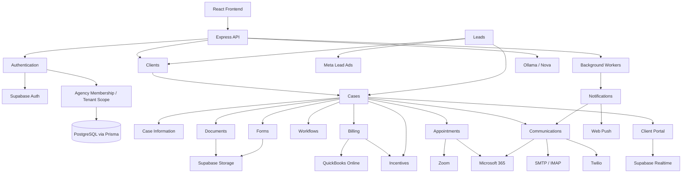

# System Map

## Graph Notes

[[Frontend-Architecture]] · [[API-Architecture]] · [[Authentication]] · [[Multi-Tenancy]] · [[Database-Overview]] · [[Clients]] · [[Cases]] · [[Case Information]] · [[Leads]] · [[Documents]] · [[Forms and Questionnaires]] · [[Workflows and Tasks]] · [[Billing and Payments]] · [[Incentives and Workload]] · [[Appointments and Booking]] · [[Communications]] · [[Client Portal]] · [[Notifications]] · [[Supabase]] · [[QuickBooks Online]] · [[Twilio]] · [[Microsoft 365]] · [[SMTP and IMAP]] · [[Zoom]] · [[Meta Lead Ads]] · [[Web Push]] · [[Ollama]]

## Worker Topology

`backend/src/server.js` starts form revision, communication outbox/inbound/maintenance, lead intake/reactivation/stale/overdue, workload, booking reminder/payment-hold, payment schedule, QuickBooks webhook, appointment meeting/calendar/no-show, notification scheduler/delivery, automated reminder, case-information drift, incentive retry, Zoom maintenance, and UCI communication matching workers. Most use database state and several use `backend/src/services/workerLeaseService.js` to avoid duplicate work across processes.
